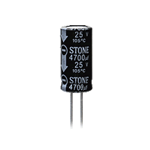

元器件篇
=======

要学习PCB首先要知道有那些电子元器件可供我们使用，目前的元器件种类至少有上百万种，这些元器件里面光是同一内核不同封装的IC芯片有可能就有4种，有的是插件形式的，有的是贴片形式的，林林总总可谓是眼花缭乱烦不胜数。
如果要将这些电子元器件统统记住，恐怕最强大脑也做不到，因为不但陈品繁多，每天都还有新的元器件在产生，因此你就不要报希望能够记住全部的元器件了，我们只要记住那些常用的就可以了。

我这里介绍的内容不一定按照从易到难的顺序，而是从我接触学习PCB的过程的角度来介绍，因此这个札记的内容是非线性的，你可以选取你需要的章节来阅读。

# 元器件的分类

电子元器件主要分为两类，一类是**无源元件(Passive Component)**，一类是**有源元件(Active Component)**

> 考虑到**无源**和**有源**这两个中文词在不同地方会有不同的理解，这里将把中文翻译成原来的英文单词解释，如此一来将会一目了然的知道什么是**无源**什么是**有源**了

**无源元件**

1. 电阻(resistor)
2. 排阻(resistor network)
3. 电容器(capacitor)
4. 电感(inductor)
5. 变压器(transformer)
6. 继电器(relay)
7. 按键(key)
8. 蜂鸣器、喇叭(speaker)
9. 开关(switch)

# 元器件的封装

在PCB设计种的元器件封装主要有两大类，一类是**插件封装**，另一类是**贴片封装**。

这两种封装技术没有谁优谁劣之分，更没有说**插件封装**是一种淘汰的封装技术，根据不同的用途选择合适的封装才是设计的要点。

通常在需要**大功率**或者**大电流**的情况下，会选择**插件封装**的元器件，因为**插件封装**的体积可以做的比较大，因此可以选择的材料范围就比较广了，就拿电阻来说，如果电流的功率要达到5W，那么就要选择**水泥电阻**

这种电阻使用水泥将电阻丝包裹起来，可以起到很好的散热和绝缘的作用。

> 这里有意思的是水泥电阻的阻抗或许只有几个欧姆，但是经过电阻的电流有几个安培甚至十几个安培哦

而对于功率比较小的场合下，比如处理信号的电路中，就可以使用**贴片封装**的电阻了,通常**贴片封装**的元器件体积非常小，最小的可能就是手机上用的那种密密麻麻的贴片元件了，毕竟手机中的空间是寸土寸金的么。

**插件封装**和**贴片封装**最明显的区别是焊接方式上的不同，**插件封装**的元器件通常都有长长的管脚，在安装到PCB上的时候要插到指定的过孔中，然后焊接最后把多余长度的管脚割掉。

而**贴片封装**就不需要线路板过孔处理，只要焊接到PCB上预置好的焊接处就可以了，所以**贴片封装**非常适合自动化组装，但是与**插件封装**比起来，焊接缺陷就更为隐蔽了，大型工厂的话使用光学视觉处理设备来一个一个检查，而如果是个人自己焊接的话，就要用眼睛仔细检查**虚焊**和**短路**了。

## 贴片元件的规格

这里将主要说明下**贴片元件**的规格，因为**贴片元件**的规格大多是固定死的，所以记忆起比较方便。

### 无源器件

无源器件主要是**电阻**和**电容**,在线路板中用的最多的也是这两种器件，他们的规格是跟个头大小有关系的

> 注意贴片规格我们通常使用英制单位

| 规格  | 长(mm) | 宽 (mm) | 高 (mm)|
| :--: |:------:| :-------:|:-------:|
| 0201 | 0.6    | 0.3      | 0.23    |
| 0402 | 1      | 0.5      | 0.3     |
| 0603 | 1.6    | 0.8      | 0.4     |
| 0805 | 2.0    | 1.25     | 0.5     |
| 1206 | 3.2    | 1.6      | 0.55    |
| 1210 | 3.2    | 2.5      | 0.55    |
| 1812 | 4.5    | 3.2      | 0.55    |
| 2010 | 5.0    | 2.5      | 0.55    |
| 2512 | 6.4    | 3.2      | 0.55    |

上面的表格就是我们通常使用的**贴片封装**的大小，常用的规格是**0805**这个，这个大小在可操作性和空间利用率上是最合适的，如果PCB的空间实在有限，而且还是手工焊接的话那么可以使用**0603**规格，再比这个小的规格就不是人能够操作的了，只有机器能够操作了。
而比**0805**规格要大的贴片主要是用于电流比较大的情况下使用，可以代替一部分的**插件封装**的电阻

## 如何识别元器件的正负极

### 电阻
电阻是没有正负极之分的，随便怎么接都可以

### 电容
电容分为两种**有极电容**和**无极电容**
**无极电容**是没有正负之分的，可以随便接，电路图上的符号如下

**有极电容**有正负极，无论是画图还是连接电路的时候都要分清楚正负极，否则轻则烧毁元器件，大容量的电容更是会发生爆炸。

> 安全注意! 如果发现电容过烫或者鼓包，应该立即切断电路电源，否则会引发电容爆炸，电容容量越大，爆炸的威力越大。因此在测试线路板的时候应该做好防护措施！

有极电容的电路图符号如下

图示符号中有明显的标注出`+正极`，也有一些软件的符号没有`+`标注出来，但是弯曲的那一边肯定代表了**负极**，看到这种符号的时候就要注意正负极了

### 二极管

单独的二极管都是有方向性的，它的电路图符号如下

二极管是一个三角形的符号，三角形的尖端是连接`负极`，三角形的边是连接`正极`，我们通常都是使用二极管正向导通的性质，所以`正极接正极，负极接负极`

不过还有一种**稳压二极管**也叫做**齐纳二极管**，这种二极管是利用二极管逆向导后，二极管的正极的电压极为稳定的特性，用来做稳压使用，在电路中连接方法与普通二极管刚好相反，`正极接二极管负极，负极接二极管正极`，符号如下

### 电感

电感基本上跟导线差不多，所以也没有正负之分，随便连接